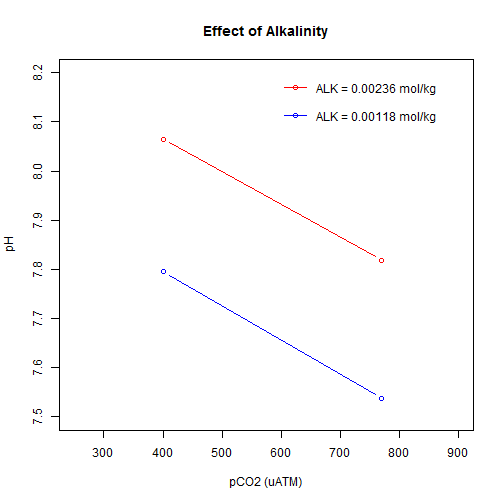

Alex: Effect of Alkalinity Changes
========================================================

I've calculated the effect on the actual pH of changing the Alkalinity. You can see the importance of getting it right


```r
a <- carb(24, c(400, 400, 770, 770), c(0.00118, 0.00236, 0.00118, 0.00236), 
    T = 20, S = 32)
a
```

```
##   flag  S  T P    pH       CO2 pCO2  fCO2     HCO3       CO3      DIC
## 1   24 32 20 0 7.795 1.313e-05  400 398.7 0.001025 5.349e-05 0.001091
## 2   24 32 20 0 8.065 1.313e-05  400 398.7 0.001907 1.853e-04 0.002106
## 3   24 32 20 0 7.537 2.528e-05  770 767.4 0.001089 3.139e-05 0.001146
## 4   24 32 20 0 7.818 2.528e-05  770 767.4 0.002080 1.145e-04 0.002220
##       ALK OmegaAragonite OmegaCalcite
## 1 0.00118         0.8441        1.307
## 2 0.00236         2.9244        4.527
## 3 0.00118         0.4954        0.767
## 4 0.00236         1.8074        2.798
```


And here it is plotted. Blue line is with alkalinity measured at 120 mg/L (about 0.001186 mol/Kg) and red line is twice that.


```r
plot(a[c(2, 4), 7], a[c(2, 4), 5], type = "b", pch = 21, col = "red", xlim = c(250, 
    900), ylim = c(7.5, 8.2), xlab = "pCO2 (uATM)", ylab = "pH", main = "Effect of Alkalinity")
points(a[c(1, 3), 7], a[c(1, 3), 5], type = "b", col = "blue")
legend(600, 8.2, legend = c("ALK = 0.00236 mol/kg", "", "ALK = 0.00118 mol/kg"), 
    col = c("red", "white", "blue"), lty = "solid", pch = c(21, 21, 21), text.col = "black", 
    bty = "n", y.intersp = 1)
```

 


And this is a nice look at what happens if as you increase the Alkalinity. Notice the BIG differences at a low ALK. For reference your readings for ALK were about 0.00118 mol/kg.


```r
loCO2 <- carb(flag = 24, c(400, 790), seq(0.001, 0.005, length.out = 15), T = 18, 
    S = 37)
hiCO2 <- carb(flag = 24, c(790), seq(0.001, 0.005, length.out = 15), T = 18, 
    S = 37)
plot(loCO2$ALK, loCO2$pH, type = "b", pch = 16, col = "red", ylim = c(7.4, 8.3), 
    main = "Relationship between Alkalinity, pH and pCO2", xlab = "Alkalinity (mol/kg)", 
    ylab = "pH")
points(hiCO2$ALK, hiCO2$pH, type = "b", pch = 17, col = "blue")
legend(0.0033, 7.55, legend = c("pCO2 = 400 uATM", "", "pCO2 = 790 uATM"), col = c("red", 
    "white", "blue"), lty = "solid", pch = c(16, 21, 17), text.col = "black", 
    bty = "n", y.intersp = 1)
```

 


This figure shows how you can under- or over- estimate the pCO2 by not getting the Alkalinity right. Once you know the alkalinity then you can use this relationship to figure out where you should be setting your pH to get the desired pCO2 (Michelle's system), or what pH you will get if you bubble through co2 at a known partial pressure (Alex's system).


```r
loALK <- carb(flag = 8, seq(7.5, 9, length.out = 15), 0.00118, T = 18, S = 37)
midALK <- carb(flag = 8, seq(7.5, 9, length.out = 15), 0.00156, T = 18, S = 37)
hiALK <- carb(flag = 8, seq(7.5, 9, length.out = 15), 0.00354, T = 18, S = 37)
plot(loALK$pH, loALK$pCO2, type = "b", pch = 16, col = "red", main = "Relationship between Alkalinity, pH and pCO2", 
    xlab = "pH", ylab = "pCO2")
points(midALK$pH, midALK$pCO2, type = "b", pch = 17, col = "blue")
points(hiALK$pH, hiALK$pCO2, type = "b", pch = 15, col = "green")
legend(8.3, 800, legend = c("ALK = 0.00118 mol/kg", "ALK = 0.00156 mol/kg", 
    "ALK = 0.00354 mol/kg"), col = c("red", "blue", "green"), lty = "solid", 
    pch = c(16, 17, 15), text.col = "black", bty = "n", y.intersp = 1)
```

 


# My Point?
1. It is really important to be accurate with all these measurements
2. I would like to see you investigate what the impact of changing these parameters in the system is. It will help you understand what is going on with the chemistry
3. For instance what happens if the temperature changes by 3 degrees (could happen in CARL)?
4. What about the salinity?

Author=CR
Date= Mon Jul 14 16:25:08 2014
